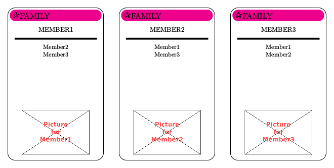

playingcards
============

Latex macros to create "Happy Families" cards.

Usage
=====
To create cards for a family with 3 members, use:
```latex
\documentclass[preview,border=4mm,multi=true]{standalone}
\usepackage{lmodern}

\usepackage{cardfamily}
\standaloneenv{tikzpicture}

\begin{document}
\createfamily{Family}{magenta,80,}
 {
  {Member1,picture1.png},
  {Member2,picture2.png},
  {Member3,picture3.png}
 }
\playingcardfamily{Family}
\end{document}
```

The syntax for creating a family is
```latex

\createfamily{Familyname}{color,dingsymbolnumber,\fontsize}
 {
  {Member name, picture_name},
  ...
 }
```

Example
=======
The code above would result in 3 cards looking like this:

